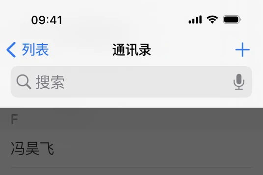
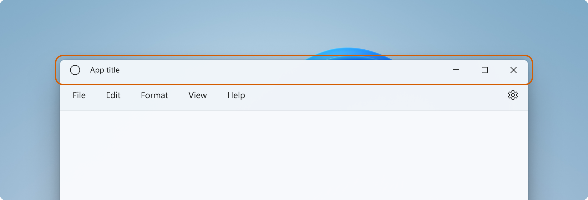
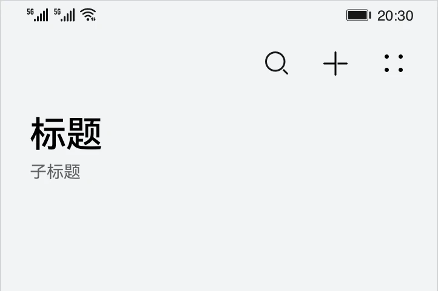
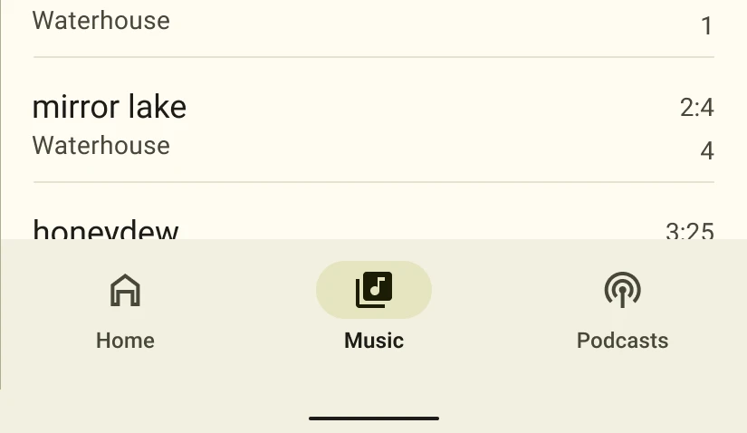
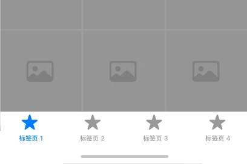
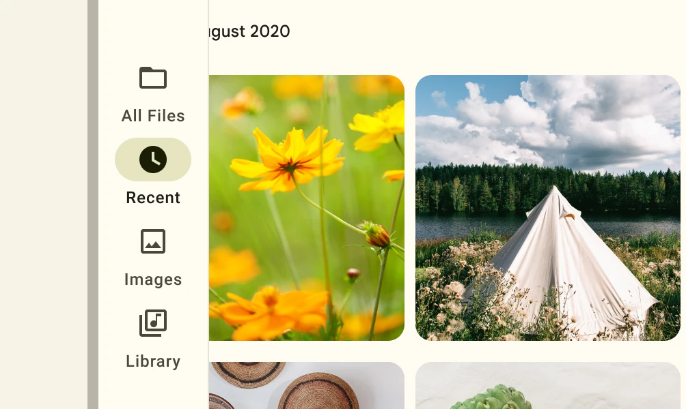
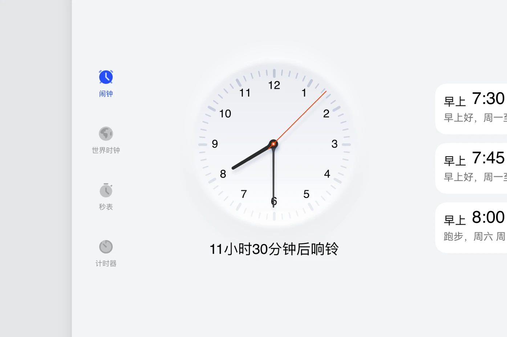

# 定义

本定义从 Android 的角度出发，因此可能和 iOS、Windows 等平台的定义不太一样

::: details 本页结构

- 大分类
  - 说明
  - 小分类（如果有）
    - 说明
    - 叫法区别
    - 示例图
    - 相关链接

:::

## 应用栏/工具栏 (App bar / Tool bar)

应用栏（也称为“操作栏”、“工具栏”）是应用的一个页面中最重要的设计元素之一，因为它为用户提供了熟悉的视觉结构和交互元素。

使用应用栏可让您的应用与其他应用保持一致，从而让用户能够快速掌握如何操作您的应用并获得出色的体验。

应用栏的主要功能如下：

- 一个专用区域，可以**标识您的应用**并**指明用户在应用中的位置**。
- 以可预测的方式**访问搜索等重要操作**。
- 支持**导航和视图切换**（通过标签页或下拉列表）。

应用栏又分为顶部应用栏、底部应用栏。

::: tip
通常情况下，“应用栏”是指“顶部应用栏”。
:::

### 顶部应用栏（Top app bar）

顶部应用栏位于屏幕的顶部，但在状态栏下方。

::: tip
通常情况下，搜索栏在顶部应用栏内。
:::

::: info 叫法区别

- Android (Material Design)：顶部应用栏 (Top app bar)
- iOS：导航栏 (Navigation bar)
- Windows (Fluent Design): 标题栏 (Title bar)
- HarmonyOS Design：标题栏 (Title bar)

:::

---

**示例图：**

- Android (Material Design)
    

    
    

- iOS
    

    
    

- Windows (Fluent Design)
    

    
    

- HarmonyOS Design
    

    
    

---

**相关链接：**

- [添加应用栏](https://developer.android.google.cn/training/appbar?hl=zh-cn) - Android 开发者
- [顶部应用栏](https://m3.material.io/components/top-app-bar/overview) - Material Design 3
- [导航栏](https://developer.apple.com/cn/design/human-interface-guidelines/navigation-bars) - Apple 开发者文档
- [标题栏](https://developer.harmonyos.com/cn/docs/design/des-guides/title-bar-0000001156785281) - HarmonyOS 设计

### 底部应用栏

敬请期待

## 状态栏 (Status bar)

状态栏是展示关于设备的详细信息与手机的周围环境的元素，它可以快速的让用户获得关于手机现在的状态，比如网络信号、电池电量、时间、运营商等等。

状态栏一般由系统提供这种状态栏叫做“系统状态栏 (System status bar)”，但是在一些情况下，应用也有自己的状态栏，叫做“应用内状态栏 (The status bar in application)”

::: tip
一般情况下，“状态栏”是指“系统状态栏”。
:::

### 系统状态栏 (System status bar)

系统状态栏几乎会在所有界面都展示，他们固定在屏幕顶部。

::: info 叫法区别

- Android (Material Design)：状态栏 (Status bar)
- iOS：状态栏 (Status bar)
- Windows (Fluent Design): 未知
- HarmonyOS Design：状态栏

:::

---

**示例图：**

- Android (Material Design)
    

    
    

- iOS
    

    
    

- HarmonyOS Design
    

    
    

### 应用内状态栏

应用内状态栏一般在视频播放页面等全屏场景下比较常见，他们跟随应用的页面同时出现或者消失。

## 导航栏

导航栏分为两种，一种是固定在屏幕一侧的“系统导航栏”，一种是几乎只在应用主页面才出现的“应用导航栏”

::: tip
一般情况下，“导航栏”是指“系统导航栏”。
:::

### 系统导航栏

未完待续

::: tip
导航栏不一定位于屏幕下方，导航栏还可能位于左侧、右侧，甚至是状态栏内/外。
:::

::: info 叫法区别

- Android (Material Design)：导航栏
- iOS：**iOS 没有系统导航栏**
- Windows (Fluent Design): 任务栏
- HarmonyOS Design：导航栏

:::

### 底部应用导航栏

底部应用栏位于屏幕底部，通常包含 2-5 个项目

底部应用导航栏可让用户在较小的设备上切换用户界面视图。

::: info 叫法区别

- Android (Material Design)：应用导航栏 (Bottom app bar)
- iOS：标签页栏 (Tab bar)
- Windows (Fluent Design): **Fluent Design 可能没有底部应用导航栏**
- HarmonyOS Design：底部页签 (Bottom tab)

:::

---

**示例图：**

- Android (Material Design)
    

    
    

- iOS
    

    
    

### 侧边应用导航栏 (Navigation rail)

侧边应用导航栏可让用户在中型设备上切换用户界面视图。

::: tip
侧边应用导航栏本质就是**将底部应用导航栏的内容纵向排列**。

侧边应用导航栏与导航抽屉的区别如下

|              | 侧边应用导航栏 | 导航抽屉 |
| ------------ | :------------: | :------: |
| 可展开       |       X        |    V     |
| 分割线       |       X        | 可以拥有 |
| 其他任何控件 |       X        | 可以拥有 |
| 项目数量     |      2-5       |   2-N    |

:::

::: info 叫法区别

- Android (Material Design)：导航栏杆
- iOS：**Fluent Design 可能没有侧边导航栏**
- Windows (Fluent Design): **Fluent Design 可能没有侧边导航栏，但是 Microsoft Store 拥有。**
- HarmonyOS Design：侧边导航栏

:::

---

**示例图：**

- Android (Material Design)
    

    
    

<!-- - Windows (Fluent Design)
    

    
    
 -->
- HarmonyOS Design
    

    
    

## 侧滑栏/导航抽屉

导航抽屉可让用户在较大的设备上切换用户界面视图。

## 对话框

## 工具提示

## 参考链接

- [UI设计知识系列 二、界面中的“栏”](https://zhuanlan.zhihu.com/p/60171900) - 知乎
