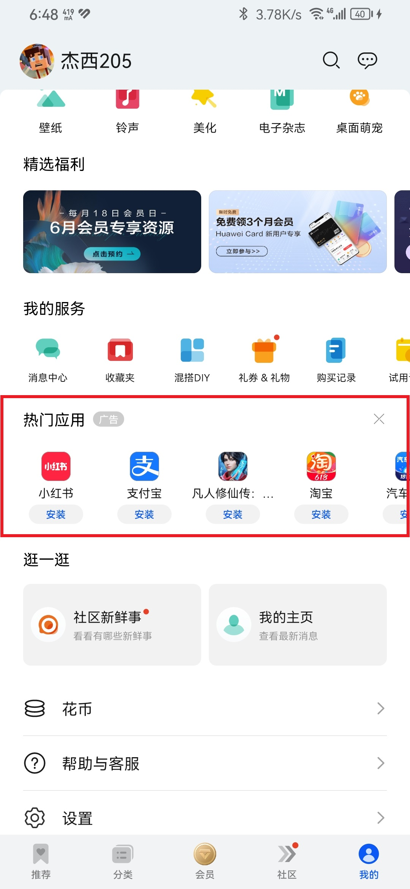

# 规范（草案）

版本：v0.0

::: tip

- 本文用[数学上的区间](https://zhuanlan.zhihu.com/p/364617647)（如 `[a,b]` ）表示 a 到 b 之间的范围。
- 部分名词请参考[《定义》](./definitions.md)。
- 条目内示例仅对当前条目负责，示例内很有可能违反了其他条目，请注意辨别。

:::

::: details 本页结构

- 必须条目
  - 条目 1
    - 简介与原因
    - 适用条件
    - 技术细节
    - 正面示例
    - 反面示例
  - 条目 2
    - ...
  - ...
- 可选条目
  - 条目 3
    - 权重与分值
    - ...
- 扣分条目
  - 条目 4
    - 权重与分值
    - ...

:::

## 必须条目

软件必须满足必须条目内所有内容是成为“蓝莓软件”的“必要条件”

### 禁止涉及有害内容

禁止涉及“黄”、“赌”、“毒”、“反动”等有害内容。

> 这些有害内容会引起身体不适，并且甚至在有些国家的法律中是严格禁止的。

适用条件：

- 所有软件

反面示例：

- P******
- 氵**力

### 无开屏广告

取消在软件首页之前显示广告，并删除相关代码

> 添加开屏广告后会严重拖慢软件启动时间。\
> 在现代软件越来越臃肿以及软件厂商在想方设法添加更多开屏广告的趋势下，非常影响用户体验。

适用条件：

- 所有软件

技术细节：

- 如果自定义启动页（基于主题和系统以外的）拥有渲染时间，除非以下情况，否则一律视为开屏广告。
  - 准备首次启动时必要数据
  - 播放自定义进入动画（动画开始前渲染时间必须小于 1s）
  - 大型 Studio、IDE、编辑类等需要准备大量数据的软件除外
  - 框架问题，如：PWA 应用、Fusion App
- 如果用户在回到软件时软件当前页面**没有被杀掉**，则**不能出现开屏页面**，否则一律视为开屏广告。
- **不可以自动弹出开启开屏广告的提醒**，否则视为开屏广告默认开启。

::: tip

- 已知必须启动时准备数据的框架：AndroLua+、Fusion App

:::

### 在拒绝权限的情况下依旧运行

禁止因权限（包括 root）问题拒绝运行，除非是必须权限。

> 安卓平台大部分情况是不需要任何权限的，用户拒绝权限后仍旧有大量替代方法继续操作。如果您的应用必须依赖某一种或多种权限才能继续运行，请告知用户为什么要申请这些权限。

### 默认关闭无关的悬浮内容

默认关闭任何与页面内主要内容无关的悬浮内容与任何活动

> 悬浮内容通常为一个页面的常用功能，但与内容无关的悬浮内容用户通常不感兴趣。因为这些内容会悬浮在其他内容之上，这会极大降低用户体验。

适用条件：

- 所有软件

::: tip

- 您可以在设置内添加开关，允许用户打开无关的悬浮内容。
- 您不可以自动弹出开启无关悬浮内容的提醒，否则视为无关悬浮内容默认开启。

:::

::: tip
部分设计规范的应用栏、底栏等看起来像悬浮内容，但是实际上与悬浮内容无关
:::

::: details 允许的悬浮内容（白名单）

- 文件管理页面
  - “新建”、“复制”、“粘贴”等文件操作按钮
- 评论页面
  - “开始评论”等与评论相关按钮
- 编辑页面
  - “保存数据”、“重新载入”等读写相关按钮
  - 搜索（文件编辑）、画笔工具（画图工具）、音量条（音视频工具）等与辅助编辑有关按钮
- 如需返回数据，则允许“确认返回”按钮
- 对话框与遮罩

:::

::: details 禁止的悬浮内容（黑名单）

- 任何推广、活动
- 任何做 XXX 领红包按钮（不包括聊天内好友发送的红包）
- 特定的一个资源

:::

### 广告与正常内容做区分

软件广告显著表明“广告”字样，并且禁止在相同/相似信息中穿插广告

> 显著表明“广告”字样会让用户更好区分广告与正常内容。并且相关的法律也有规定。

适用条件：

- 所有软件

技术细节：

- 字体大小
  - 一般情况下与 Badge 组件保持一致
  - Android：`[12dp,16dp]`
  - iOS：未知
  - Windows：`[9pt,12pt]`
  - MacOS：未知
  - Linux：未知
  - 跨平台：
    - Web：`[12px,16px]`
    - Python：`[12px,16px]`
    - Qt：未知
- 字体样式：与 UI 的 Badge 组件设计保持一致，不得在 UI 的 Badge 组件设计的字体的基础上加粗或减少（如果没有 Badge 组件设计，则应使用 UI 默认规范）
- 广告样式：
  - 如果UI设计内有“卡片”元素，则需要将广告放到“卡片”内
  - 只能在两个功能板块之间设置广告，禁止在信息流内插入广告

正确示例：

- 字体大小适中
- 放置到卡片内
- 不同信息中穿插广告 

::: tip
“广告”字样应与UI搭配，且使用 UI 定义的 Badge 样式的容器包裹 <Badge text="可选" />，文字应清晰可辨。
:::

### 不频繁提醒

禁止2次或者更多次主动提醒用户打开/关闭/启动某一功能/服务（包括用户引导）。（除非用户明示）

> 用户不需要应用程序“唠叨”。

适用条件：

- 所有 GUI 软件

示例：

- 错误实例

### 页面内精简显示

“我的”页面、“关于”页面、“设置”页面必须允许让用户滑动到底部，禁止做无限滚动

适用条件：

- 所有软件

典型反例：

### 不使用黑名单内 SDK

黑名单内的 SDK 是经过官方调查、不符合规范的 SDK

## 可选条目

### 完全无广告

用户非常喜欢完全无广告的应用，因为他们可以让用户花更少的时间做更多的事情。

---

适用条件：

- 所有软件

---

处理办法：

- 增加：30 分

### 启动时间短

适用条件：

- 所有软件

---

处理办法：

- 增加：10 分

### 权限申请合规

规范：

- 开屏不立刻申请权限
- 每次申请权限时有简短而不含糊的说明

### 设计风格“入乡随俗”

在不同的平台呈现不同的风格

适用条件：

- 所有 GUI 软件

处理办法：

- 增加：5 分
- 未达到适用条件，增加：5 分。

技术细节：

- Android：[Material Design](https://material.io/)
  - HarmonyOS：HarmonyOS Design
- Windows：[Fluent Design](https://fluent2.microsoft.design/)
  | [Windows 11 设计指南](https://learn.microsoft.com/zh-cn/windows/apps/design/)
  | [Windows 7 设计指南](https://learn.microsoft.com/zh-cn/windows/win32/uxguide/guidelines)
- iOS：[针对 iOS 设计](https://developer.apple.com/cn/design/human-interface-guidelines/designing-for-ios)
- MacOS：[针对 MacOS 设计](https://developer.apple.com/cn/design/human-interface-guidelines/designing-for-macos)
- iPadOS：[针对 iPadOS 设计](https://developer.apple.com/cn/design/human-interface-guidelines/designing-for-ipados)
- Linux：未知
  - HarmonyOS：同 `Android > HarmonyOS`
  - Windows：同 `Windows`

### 设计优秀

如果使用通用设计（如：Material），则按照通用设计制作软件。如果是其他闭源设计，只需要做到风格统一，简约美观。

> 好的设计会使人身心愉悦。

::: tip
智者千虑，必有一失，再好看的软件也有瑕疵。只要大体上符合规范、风格统一就行。
:::

适用条件：

- 所有 GUI 软件

处理办法：

- 增加：10 分
- 未达到适用条件，增加：10 分。

### 积极更新目标 SDK

提升 SDK 版本，积极适配最新的系统

适用条件：

- 所有 Android 软件

处理办法：

- 增加：10 分
- 未达到适用条件，增加：10 分。

规范：

- Android：目标 SDK 版本 >= 软件发布时最新 SDK 版本 - 4

### 功能丰富

功能丰富，但都是与软件本身有关的功能。

::: warning
功能丰富不代表任何功能都可以添加。如需为满足用户需求添加额外功能，请添加基本功能，并引导至第三方 APP 进行更多操作。
:::

适用条件：

- 所有软件

处理办法：

- 增加：20 分

优秀示例：

- Photoshop

### 仅申请必要权限

仅申请必要权限，用多少要多少。

> 开屏立即索要权限会导致用户对软件信任度下降，因为用户在未未知用途的情况下授予权限可能会导致发生意外情况，比如软件无法运行。

适用条件：

- 所有软件

::: details 权限白名单

- 存储权限（历史原因）
- 基于 AndroLua+ 制作的软件的权限（框架原因）
- 文件编辑软件（音视频、图像、文本等编辑器）：无
- 局域网数据互传软件（局域网内互相发现的软件）
  - 位置权限

:::

## 扣分条目

### 内置“小程序”功能

适用条件：

- 非工具箱、应用市场、小程序引擎软件

处理办法：

- 扣除：20 分

典型示例：

- 百度网盘
- 微信
- QQ
- 抖音

### 超出软件所属类型的服务范围

软件现在或者发布后1年内没有转型以支持这些功能/服务的情况下，软件提供的功能/服务不属于该软件所处类型。

---

适用条件：

- 所有软件

---

处理办法：

- 扣除：25 分

---

典型示例：

- 百度网盘
- 微信
- QQ

---

::: details 白名单功能/服务
此名单内所有的功能/服务适用于任何软件

- 将账号授予给其他APP进行登录（如果有账号登录功能）
- API 文档
- 软件设置
- 窗口小部件
- 快捷方式

:::
